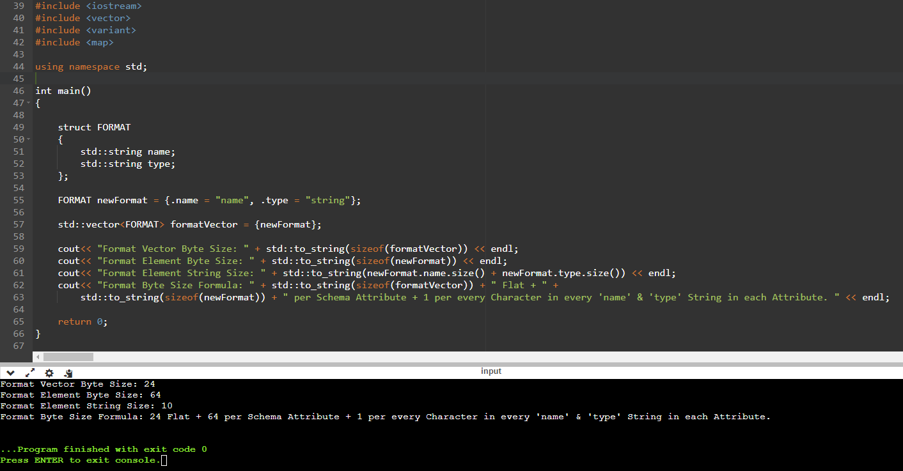

# DoyenaCore: The Future of Web3 Gaming & Itemization

DoyenaCore is an open-source asset standard tailored for Web3 game studios seeking a flexible & feature rich solution to on-chain itemization. DoyenaCore offers unparalleled functionality, performance, and customizability, all encapsulated in a self-custodial C++ smart contract & deployable on any blockchain utilizing Antelope Leap. As the Web3 gaming landscape evolves, DoyenaCore emerges not merely as an asset standard, but as an on-chain loot engine.

# Introduction

Designing a new Asset Standard is arguably one of the most challenging projects to take on in blockchain development. We felt that approaching Waxlabs for a sizeable grant on such an ambitious project with only a napkin idea wasn't the most realistic approach. 

We decided to meet Waxlabs half way & took on the initiative by self funding the development for the past six months, battle testing it live in the hands of our community.

Our [current deployment of DoyenaCore](https://waxblock.io/account/doyena.tfmw) is not the final version that we intend to release to the community; below, we have outlined our complete vision for DoyenaCore.

Something to keep in mind is that DoyenaCore should not be seen as a competitor to AtomicAssets, but rather as an extra option for creators to choose from, depending on their use case. The AtomicAssets standard provides increased user accessibility & ease of use, at the expense of performance & functionality.

# DoyenaCore Native Functionality

**1. Self Custodial Collection Deployment**
- Empowers creators with complete control and ownership over their collections, paving the way for a more decentralized & trustless Web3 space

**2. NFT Wrapping**
- Facilitates seamless interoperability between AtomicAssets & DoyenaCore
- Allows creators to provide wrapping between AtomicAssets & DoyenaCore, and vice versa

**3. On-Chain Template Mint Numbers**
- Enables smart contract functionality based on NFT template mints

**4. Mutable NFT Templates**
- Empowers creators with customizable and mutable NFT Templates

**5. Mutable NFT Drop Tables**
- Flexible drop tables for on-chain / in-game loot creation or for use as a pack opener

**6. Dynamic Drop Tables**
- Utilizes Tags and Conditions for dynamic processing of drop tables
- Incorportated during both NFT generation and NFT Trait generation

**7. Abililty to create Giant Drop Tables**
- Can support dynamic drop tables with thousands of outputs, during both Minting NFTs & rolling for Traits
- Our deployment currently has [915 functional Traits](https://waxblock.io/account/doyena.tfmw?code=doyena.tfmw&scope=doyena.tfmw&table=doyena2&lower_bound=&upper_bound=&limit=10#contract-tables) spanning 6 categories that can roll on NFTs.

**8. Native Support for Socketing NFTs**
- Seamlessly passes the properties of NFTs to other NFTs
- Highly customizable socketing parameters for games (i.e. Helmet's under Template 26 can only be socketed with Jewels in their second Socket Slot)
- Recursive NFT socketing, allowing for very unique game design,  i.e. :
  - Generative Skeleton NFT 
  - Which can be socketed with a Generative Skull NFT 
  - Which can be socketed with a Generative Jaw NFT 
  - Which can be socketed with up to 16x Generative Teeth NFTs
- Transfers ownership of all socketed (child) NFTs upon transfering the parent NFT
- Unsockets all socketed (child) NFTs from parent NFT upon burning parent NFT
- Disallows modification, transfers, trades, burns or usage of socketed (child) NFTs while socketed within a parent NFT

**9. Native Support for Backing NFTs with FTs**
- Facilitates the deposit of fungible tokens from any smart contract into NFTs, which can be released upon burning said NFT
- Easily incorporate extra smart contract functionality that can trigger upon burning NFTs

**10. Allows users to securely "Use" or "Equip" NFTs**
- Facilitates all kinds of smart contract functionality without the requirement of transferring NFTs to a smart contract for security purposes

**11. Dictate fees for any smart contract functionality, such as minting NFTs or modifying Traits**
- Can support any fungible token
- Can delegate fee collection to one or more wallets with varying percentages
- Allows creators to dictate secondary fees
- Allows creators to whitelist the sale of NFTs through privileged smart contracts, enforcing secondary fee collection

**12. On-Chain Stash Tab Management**
- Enables users to be able to manage their NFTs in a multi-dimensional, grid style fashion, as seen in games such as Diablo, Path of Exile and Baldur's Gate 3

**13. Decide who covers the RAM cost**
- Decide at a contract level whether the creator or the user will be responsible for covering the RAM cost when minting or modifying NFTs


# What are the problems that DoyenaCore is trying to solve?

# Problem A. AtomicAssets CPU inefficiency

The root of this problem is due to how the architecture behind AtomicAssets operates.

When it comes to CPU costs:
1. The manipulation of data within a smart contract amounts to a very small portion of CPU costs.
2. The fetching, storage and creation of data within a smart contract is responsible for the vast majority of CPU costs.

For example, lets take a look at a smart contract action that:
- Reads and deserializes an AtomicAssets NFT
- Validates and processes the owner, collection, schema, template, immutable & mutable attributes
- Performs a 'setassetdata' action to update the mutable info

```C++
#pragma once

#include <contracts/atomicassets.hpp>

void demo::claim(eosio::name & owner, std::vector<uint64_t> & asset_id){
  require_auth(owner);

  auto assets = atomicassets::get_assets(owner);
  auto asset_itr = assets.require_find(asset_id, "You do not own this Asset!);

  eosio::check(asset_itr->collection_name == (eosio::name)(std::string_view ("terraformers")), "Wrong Collection!");
  eosio::check(asset_itr->collection_name == (eosio::name)(std::string_view ("exp1.lands")), "Wrong Schema!");

  // **Issue A2.1**
  auto schema_obj = atomicassets::get_schemas(asset_itr->collection_name).get(asset_itr->schema_name.value); 
  auto template_obj = atomicassets::get_templates(asset_itr->collection_name).get(asset_itr->template_id);

  // **Issue A2.2**
  auto template_immutable_data = atomicdata::deserialize(template_obj.immutable_serialized_data, schema_obj.format); 
  auto asset_immutable_data = atomicdata::deserialize(asset_itr->immutable_serialized_data, schema_obj.format); 
  auto asset_mutable_data = atomicdata::deserialize(asset_itr->mutable_serialized_data, schema_obj.format); 

  template_immutable_data.insert(asset_immutable_data.begin(), asset_immutable_data.end());

  std::string land_type = template_immutable_data.find("land type") != template_immutable_data.end() ? 
    std::get<std::string>(template_immutable_data.find("land type")->second) : "Mountain";

  eosio::check(template_immutable_data.find("mining power") != template_immutable_data.end(), "This Asset has no Mining Power!");
  double mining_power = std::get<double>(template_immutable_data.find("mining power")->second);

  eosio::time_point now = eosio::current_time_point();
  uint32_t last_claim = asset_mutable_data.find("last claim") != asset_mutable_data.end() ? 
    std::get<uint32_t>(asset_mutable_data.find("last claim")->second) : (uint32_t)now.sec_since_epoch() - 86401;

  eosio::check((uint32)now.sec_since_epoch() - last_claim >= 86400, "Not enough time has passed since you've last claimed!");

  asset_mutable_data["last claim"] = (uint32_t)now.sec_since_epoch();

  // **Issue A2.3**
  eosio::action(eosio::permission_level{get_self(), eosio::name("active")}, atomicassets::ATOMICASSETS_ACCOUNT, 
    eosio::name("setassetdata"), std::make_tuple(get_self(), owner, asset_id, asset_mutable_data)).send();
}

```

**Issue A2.1 : The fetching of Schema Data**
- Depending on the size of the Schema, fetching Schema Data adds a large overhead to the CPU cost that is billed to users
- This is due to Schemas being stored in a ```std::vector<atomicdata::FORMAT>``` structure, which can take a substantial amount of RAM to store.



**Issue A2.1 Continued**
- In the case of having an NFT with 10 Attributes in the Schema, an estimated (24 + ((64 + 10(average name) + 6(average type)) * 10(Attributes)) = 824 Bytes can be expected.
- 824 Bytes is not all that much & is very reasonable for an NFT's Schema. But as time goes on, more Attributes are usually added to Schemas to support more smart contract functionality.
- In the case of a [particular Schema](https://wax.atomichub.io/explorer/schema/wax-mainnet/terraformers/exp2.bhc) built for TFMW, there are 66 Attributes, bringing the size up to around 5kb.
- This results in a massive CPU overhead for just reading the Schema for each NFT, even if the NFT does not contain data in all of the Schema's Attribute fields.
- With data on Schemas being immutable, but also able to be added onto, this creates a scenario where creators can **unknowningly & permanently** increase the CPU costs for any smart contract that tries to interact with their NFT.
- In the case of smart contracts that perform operations on an array of NFTs under several Schemas, this exacerbates the CPU costs, as most smart contracts are not setup to store the Schema info in a map to reuse & not re-fetch during the bulk processing of NFTs.

**Issue A2.2 : Deserialization of NFT Metadata**
- While deserialization isn't directly responsible for large CPU costs when interacting with AtomicAssets NFTs, it does play a significant role.
- The high CPU costs in this area come from fetching the data & then passing the data to the deserialization function & then receiving it back.
- During this process, the Schema is also passed along, as it's also used during the deserialization.
- Again, having a large Schema further amplifies the CPU costs in this department.

**Issue A2.3 : Updating Asset Data**
- When updating Asset data using the 'setassetdata' action, this entire process of validation happens again. The size of the asset_mutable_data object can also play a significant role in increasing CPU costs.
- Fetching the Asset and Schema objects, then serializing the asset_mutable_data that has been passed along & then modifying the row in which the Asset is contained all ramp up the CPU costs.

**Problem A : Solution**
- DoyenaCore tackles these issues by excluding Schemas & storing all NFT metadata on an Asset inside a ```std::map<std::vector<int32_t>>``` object, while leaving semantic support up to the API to interpret.
- The Attributes / Traits that NFTs can generate is instead defined on a template level.
- Storing NFT metadata in what is essentially a 2D array of int32_t integers keeps RAM costs & CPU costs low (as no deserialization is required), while also enabling a wide level of flexibility for creators.
- By default, strings such as IPFS hashes are stored & referenced from the Template, but can be optionally enabled to be stored on the NFTs themselves in the case of projects utilizing generative NFT art.

# Problem B : Nested Structures Validation Error

Deep within Antelope Leap exists a bug that is gatekeeping the creation & progression of advanced on-chain games. Although for most developers, the nested structures validation error is rarely encountered, it becomes a common source of grievance as more smart contract functionality is introduced.

Regardless of the size of the smart contract, this bug primarily pops up when an Action within a smart contract gets too large. This leads to a rather serious bottleneck for on-chain game development, as we are limited by how many variables we can process before this bug shows up.

Once this bug pops up, your smart contract will stile compile, but you simply won't be able to deploy it & upload it to the blockchain.

In the case of AtomicAssets, every Attribute that is used for some sort of smart contract functionality tacks on an extra load, as they are usually each gathered individually. You will seldom ever see NFTs with 20+ functional Attributes, since not only will smart contracts begin to max out, but designing such a collection is also quite the task.

**Problem B : Solution**

Through the use of multi-dimensional arrays, DoyenaCore is able to overcome this obstacle.

The [2D arrays](https://waxblock.io/account/doyena.tfmw?code=doyena.tfmw&scope=doyena.tfmw&table=assets&lower_bound=&upper_bound=&limit=10#contract-tables) on the NFTs behave as pointers to [6D Trait definitions](https://waxblock.io/account/origins.tfmw?code=origins.tfmw&scope=origins.tfmw&table=doyena2&lower_bound=&upper_bound=&limit=10#contract-tables) that are then used to load functional NFT data into a [3D matrix](https://waxblock.io/account/origins.tfmw?code=origins.tfmw&scope=origins.tfmw&table=explorations&lower_bound=&upper_bound=&limit=10#contract-tables) for storage & accessibility within a smart contract.

For the past 8 months, this architecture has been battle tested & demonstrated via our [free to play on-chain dungeon crawler](https://tfmw.gg/origins).

This approach to smart contract development has enabled the computation, manipulation & storage of over a thousand unique variables that players can influence through the Traits on their NFTs.

Trait definitions _can_ be stored within your deployment of DoyenaCore, however, they can also be stored within the smart contracts that are utilizing the NFTs. 

This allows the same NFT with the same Traits to have unique & rich functionality when used in different smart contracts, enabling something we call "Multi-Faceted NFTs".

This aspect of DoyenaCore is not necessary for all projects to utilize, however, resources & documentation will be provided for how to setup such an architecture alongside the (optional) 4th milestone.

# Performance Snapshots

**AtomicAssets**

Contract : 'terraminingx'
Actions : 'claim'

Functionality : 
- Fetches, processes & validates 10 NFTs
- 'setassetdata' @ 'atomicassets' calls to update 'last claim' uint32_t time stamp for each Asset individually
- Bulk token transfers

Table Fetches : 
- 20x Schema fetches
- 20x Asset data fetches (10x during contract, 10x during 'setassetdata')
- 10x Template data fetches
- 2x Token balance fetches
- 1x Config fetches

Table Emplaces : none

Table Modifications :
- 10x Asset data modifications
- 2x Token balance modifications

CPU Range : 3ms to 18ms

[Snapshot](https://waxblock.io/transaction/851fd0ec051df5dea6dd2a4c608d5e81e461a824b8ec276ad8679fc141870815)

**DoyenaCore**

Contracts : 'doyena.tfmw', 'origins.tfmw'
Actions : 'explore', 'boardgena', 'boardgenb', 'boardgenc'

Functionality : 
- Fetches, processes & validates 8 NFTs into a 3D Matrix
- 'useassets' @ 'doyena.tfmw' bulk call for all Assets in 1 Action
- 2D Procedural World Generation, rolling for Traits & Metadata on each Tile
- Enemy generation, rolling for Traits & processing into a Matrix

Table Fetches : 
- 11x Config table fetches
- 16x Asset data fetches (8x during contract, 8x during 'useassets');

Table Emplaces : 
- 'explorations' @ 'origins.tfmw', storage of 3D Character Matrix & Enemy Matrices, 3kb of RAM
- 'areas' @ 'origins.tfmw', storage of 2D Procedural World Generation

Table Modifications :
- 8x Asset data modifications
- 1x Config table modifications


CPU Range : 5ms to 20ms

[Snapshot](https://waxblock.io/transaction/4dd35a2d702a1c9810c079b55c9eaa5ff173258bdd53367f5037e3a21b5e59a0)

[Procedural World Generation](https://waxblock.io/account/origins.tfmw?code=origins.tfmw&scope=origins.tfmw&table=areas&lower_bound=&upper_bound=&limit=10#contract-tables)

# Financial Roadmap

The purpose of this grant is to secure funding for the continued development of DoyenaCore, spanning smart contract architecture, API development, Shipnode maintenance, frontend development, comprehensive documentation, peripheral tools for creators and educational resources.

All releases will be fully open sourced under an MIT license.

| Milestone | Duration (weeks) | Cost | Description |
|----------|----------|----------|----------|
| #1 | 8 | 50000 USD | Production ready release & documentation of DoyenaCore. |
| #2 | 4 | 25000 USD | Peripheral tools for creating, generating & managing collection semantics, NFT Templates, NFT Drop Tables & Trait Drop Tables for API & frontend implementations. |
| #3 | 4 | 25000 USD | Production ready release & documentation of DoyenaMarket to facilitate native trading & secondary marketplace support for DoyenaCore NFTs. |
| Optional | - | - | - |
| #4 | 8 | 50000 USD | Utilizing DoyenaCore, create a free to play On-Chain RPG Game on the WAX blockchain from scratch, serving as an educational resource for C++, blockchain development & Web3 Game Design. |

# Conclusion

With a clear vision and a proven prototype, we aim to set new standards for Web3 gaming in creativity, ownership and functionality.

We hope to shape a future where every collector is a creator, where every NFT is a masterpiece, and every blockchain game pushes the boundaries further than the games before them.

# Contact

Kas Hashemi AKA [t break](https://t.me/on_a_t_break)

[Doyen Games Inc.](https://doyen.gg)
